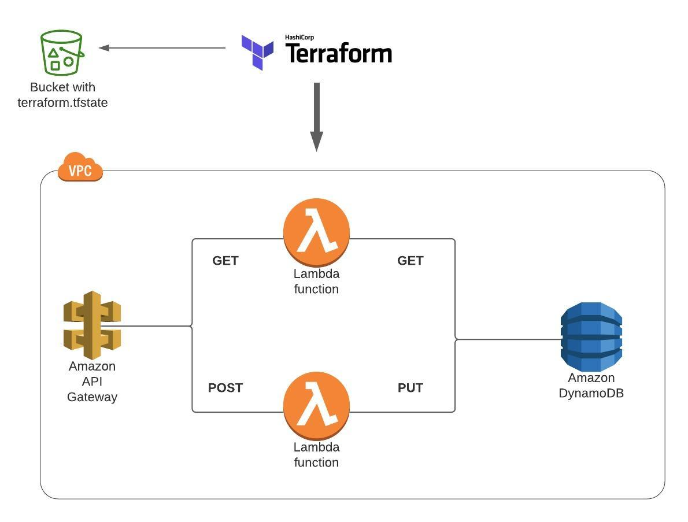

## Schematic:



## Overview of the GitHub repository:

```zsh
.
├── modules              # Folder containing all the AWS structures. of the project
│ ├── vpc                # VPC, Subnets (private and public), IGW, Tables, SG...
│ │ ├── outputs.tf
│ │ ├── variables.tf
│ │ └── main.tf
│ ├── dynamoDB           # Dynamodb table and fist data on Data Base.
│ │ ├── outputs.tf
│ │ ├── variables.tf
│ │ └── main.tf
│ ├── api                # API GateWay POST and GET- Method Execution
│ │ ├── outputs.tf
│ │ ├── variables.tf
│ │ └── main.tf
│ ├── iamRole            # AWS IAM role and policy
│ │ ├── variables.tf
│ │ ├── outputs.tf
│ │ └── main.tf
│ └── lambda             # Get and Put Lambda configuration
│ ├── outputs.tf
│ ├── variables.tf
│ └── main.tf
├── PUT.zip
│ └── index.js           # JavaScript code for the Lambda put: Code
├── GET.zip
│ └── index.js           # JavaScript code for the Lambda get: Code
├── main.tf              # File responsible for AWS authentication, and also for calling all modules.
└── main.tfvars          # Contains variables, and settings for the structure.
```

### GET - index.js

```javascript
"use strict";
const AWS = require("aws-sdk");

AWS.config.update({ region: "us-west-2" }); # ADD YOUR AWS REGION HERE

exports.handler = async (event, context) => {
  const ddb = new AWS.DynamoDB({ apiVersion: "2012-10-08" });
  const documentClient = new AWS.DynamoDB.DocumentClient({
    region: "us-west-2", # ADD YOUR AWS REGION HERE
  });

  let responseBody = "";
  let statusCode = 0;

  const { id } = event.pathParameters;

  const params = {
    TableName: "Users",zzz
    Key: {
      id: id,
    },
  };

  try {
    const data = await documentClient.get(params).promise();
    responseBody = JSON.stringify(data.Item);
    statusCode = 200;
  } catch (err) {
    responseBody = `Unable to get user data`;
    statusCode = 403;
  }

  const response = {
    statusCode: statusCode,
    headers: {
      myHeader: "test",
    },
    body: responseBody,
  };

  return response;
};
```

### PUT - index.js

```javascript
'use strict'
const AWS = require('aws-sdk');

AWS.config.update({ region: "us-west-2"});  # ADD YOUR AWS REGION HERE

exports.handler = async (event, context) => {
  const ddb = new AWS.DynamoDB({ apiVersion: "2012-10-08"});
  const documentClient = new AWS.DynamoDB.DocumentClient({ region: "us-west-2"}); # ADD YOUR AWS REGION HERE

  let responseBody = "";
  let statusCode = 0;

  const { id, firstname, lastname } = JSON.parse(event.body);

  const params = {
    TableName: "Users",
    Item: {
      id: id,
      firstname: firstname,
      lastname: lastname
    }
  }

  try {
    const data = await documentClient.put(params).promise();
    responseBody = JSON.stringify(data);
    statusCode = 201;
  } catch (err) {
    responseBody = `Unable to put user data`;
    statusCode = 403;
  }

  const response = {
    statusCode: statusCode,
    headers: {
      "myHeader": "HeadTester"
    },
    body: responseBody
  }

  return response;
}
```
